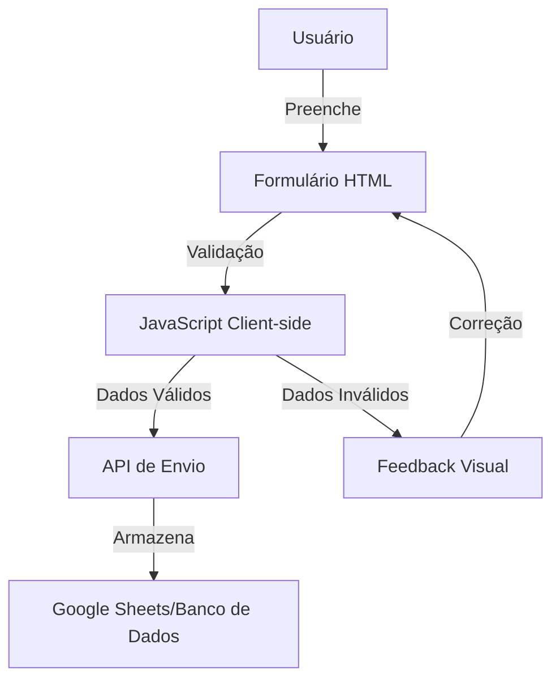

# Design Document

## Overview

Este documento descreve o design técnico para implementar a sincronização da documentação do projeto e a funcionalidade de validação e envio de formulário na landing page. O objetivo é garantir que a documentação seja consistente entre os ambientes e que o formulário da landing page capture leads de forma eficiente, validando os dados inseridos e enviando-os para armazenamento.

## Arquitetura

### Sincronização da Documentação

A sincronização da documentação será realizada através do fluxo padrão do Git, garantindo que as alterações locais sejam refletidas no repositório remoto. Não há necessidade de arquitetura específica para esta parte além do próprio sistema de controle de versão.

### Formulário da Landing Page

A arquitetura para o formulário seguirá um padrão de validação client-side com envio de dados via API:



## Componentes e Interfaces

### 1. Componente de Formulário HTML

O formulário HTML será responsável pela interface com o usuário e conterá os seguintes campos:

- Nome (obrigatório)
- Email (obrigatório)
- Telefone (opcional)
- Mensagem/Comentário (opcional)
- Botão de envio

Interface HTML:

```html
<form id="leadForm" class="lead-form">
  <div class="form-group">
    <label for="nome">Nome*</label>
    <input type="text" id="nome" name="nome" required>
    <span class="error-message" id="nome-error"></span>
  </div>
  
  <div class="form-group">
    <label for="email">Email*</label>
    <input type="email" id="email" name="email" required>
    <span class="error-message" id="email-error"></span>
  </div>
  
  <div class="form-group">
    <label for="telefone">Telefone</label>
    <input type="tel" id="telefone" name="telefone">
    <span class="error-message" id="telefone-error"></span>
  </div>
  
  <div class="form-group">
    <label for="mensagem">Mensagem</label>
    <textarea id="mensagem" name="mensagem"></textarea>
  </div>
  
  <button type="submit" id="submit-btn">Enviar</button>
  <div id="form-status" class="form-status"></div>
</form>
```

### 2. Componente de Validação JavaScript

Este componente será responsável por validar os dados do formulário em tempo real e no momento do envio.

Interface JavaScript:

```javascript
// Interfaces para validação
interface ValidationResult {
  isValid: boolean;
  message?: string;
}

interface FormData {
  nome: string;
  email: string;
  telefone?: string;
  mensagem?: string;
}

// Funções de validação
function validateEmail(email: string): ValidationResult;
function validateRequired(value: string, fieldName: string): ValidationResult;
function validatePhone(phone: string): ValidationResult;
function validateForm(formData: FormData): ValidationResult[];
```

### 3. Componente de Envio de Dados

Este componente será responsável por enviar os dados validados para armazenamento.

Interface JavaScript:

```javascript
interface SubmissionResult {
  success: boolean;
  message: string;
}

// Função de envio
function submitFormData(formData: FormData): Promise<SubmissionResult>;
```

## Modelos de Dados

### Modelo de Dados do Formulário

```javascript
interface FormData {
  nome: string;
  email: string;
  telefone?: string;
  mensagem?: string;
  dataEnvio: Date;
}
```

### Modelo de Resposta da API

```javascript
interface ApiResponse {
  success: boolean;
  message: string;
  data?: any;
}
```

## Tratamento de Erros

### Erros de Validação

1. **Campos Obrigatórios**: Exibir mensagem de erro abaixo do campo quando não preenchido.
2. **Formato de Email**: Validar usando regex e exibir mensagem específica para formato inválido.
3. **Formato de Telefone**: Validar usando regex e exibir mensagem específica para formato inválido.

### Erros de Envio

1. **Falha na Conexão**: Armazenar dados localmente e tentar reenviar quando a conexão for restabelecida.
2. **Erro no Servidor**: Exibir mensagem amigável e oferecer opção de tentar novamente.
3. **Timeout**: Definir um tempo limite para a requisição e notificar o usuário em caso de timeout.

## Estratégia de Teste

### Testes de Validação

1. **Teste de Campos Obrigatórios**: Verificar se o formulário impede o envio quando campos obrigatórios estão vazios.
2. **Teste de Formato de Email**: Verificar se o validador de email rejeita formatos inválidos.
3. **Teste de Formato de Telefone**: Verificar se o validador de telefone aceita apenas números e caracteres permitidos.

### Testes de Envio

1. **Teste de Envio Bem-sucedido**: Verificar se os dados são enviados corretamente quando todos os campos são válidos.
2. **Teste de Falha de Conexão**: Simular falha de conexão e verificar se o sistema tenta reenviar.
3. **Teste de Resposta de Erro do Servidor**: Simular erro do servidor e verificar se a mensagem de erro é exibida corretamente.

### Testes de Interface

1. **Teste de Feedback Visual**: Verificar se os erros são destacados visualmente de forma clara.
2. **Teste de Responsividade**: Verificar se o formulário funciona corretamente em diferentes tamanhos de tela.
3. **Teste de Acessibilidade**: Verificar se o formulário é acessível para usuários com deficiência.

## Decisões de Design

### Validação em Tempo Real vs. No Envio

Optamos por implementar validação em tempo real para proporcionar feedback imediato ao usuário, melhorando a experiência de uso. No entanto, também manteremos a validação no momento do envio como uma camada adicional de segurança.

### Armazenamento de Dados

Para simplificar a implementação inicial, utilizaremos o Google Sheets como destino dos dados do formulário, através da API do Google Sheets. Esta abordagem permite armazenamento e acesso fácil aos dados sem necessidade de configurar um banco de dados dedicado.

### Feedback Visual

O feedback visual de erros será implementado com cores e ícones para tornar claro quando um campo contém erro. Utilizaremos vermelho para indicar erro e verde para indicar sucesso, seguindo convenções de UX comuns.

### Segurança

Para proteger contra spam e ataques automatizados, implementaremos um sistema de reCAPTCHA invisível que não interfere na experiência do usuário, mas ajuda a garantir que o formulário seja preenchido por humanos.

## Considerações Futuras

1. **Migração para Banco de Dados**: Em versões futuras, podemos migrar o armazenamento de dados para um banco de dados dedicado para maior escalabilidade.
2. **Integração com CRM**: Adicionar integração com sistemas de CRM para gerenciamento de leads.
3. **Análise de Conversão**: Implementar rastreamento de eventos para analisar taxas de conversão e comportamento do usuário.
4. **Personalização de Mensagens**: Permitir personalização das mensagens de sucesso e erro.